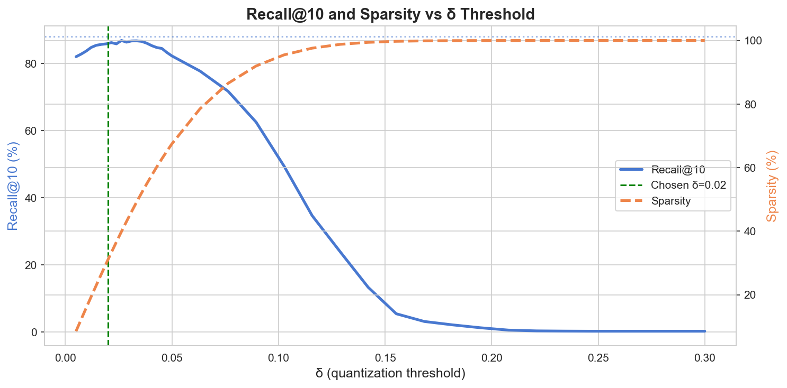
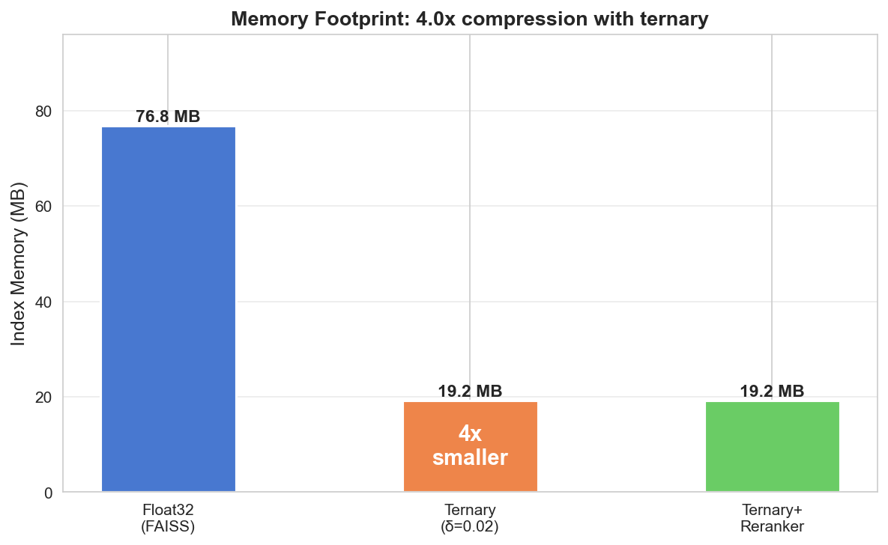
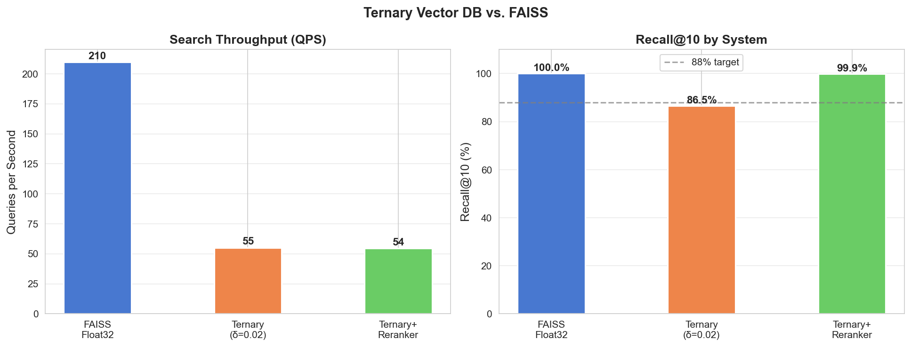

# Ternary-Native Vector Database

---

## Abstract

Modern vector databases store embeddings as 32-bit floats, spending four bytes per dimension regardless of how much information each dimension actually carries. This project investigates whether replacing float32 embeddings with ternary representations — where each dimension takes a value in $\{-1, 0, +1\}$ — can meaningfully reduce memory consumption without sacrificing retrieval quality. Using 50,000 passages from MS MARCO and a standard sentence embedding model, we build a ternary index that achieves a 4x reduction in index memory (76.8 MB → 19.2 MB) with 86.5% Recall@10 against a FAISS float32 baseline. A two-stage pipeline that uses ternary search for candidate retrieval followed by float cosine reranking recovers 99.9% Recall@10 at the same memory footprint. We also show, via radix economy theory, why base-3 is the most information-efficient integer number system, and why the signed alphabet $\{-1, 0, +1\}$ is the only ternary representation that preserves the geometric structure of embedding space.

---

## Methodology

### Dataset and Embeddings

We use the MS MARCO passage retrieval corpus (v1.1), sampling 50,000 passages from the training split. Each passage is encoded with `sentence-transformers/all-MiniLM-L6-v2`, producing 384-dimensional float32 vectors that are unit-normalized by construction (all L2 norms = 1.0, values in the range −0.28 to +0.28 with std = 0.05).

### Baseline: FAISS Flat Index

The float32 baseline uses a FAISS `IndexFlatIP` (inner product) index over L2-normalized vectors, which is equivalent to exact cosine similarity search. This is a brute-force flat index — no approximation, no quantization — and serves as the upper bound on retrieval quality. Index memory is exactly $N \times D \times 4$ bytes = 76.8 MB for $N = 50{,}000$, $D = 384$.

### Ternary Quantization

Each float32 embedding is converted to a ternary vector using a threshold $\delta$:

$$t_i = \begin{cases} +1 & \text{if } v_i > \delta \\ -1 & \text{if } v_i < -\delta \\ 0 & \text{otherwise} \end{cases}$$

Dimensions within $[-\delta, +\delta]$ are treated as carrying insufficient signal and zeroed out. The resulting vectors are stored as int8, giving an unconditional 4x memory reduction over float32 regardless of $\delta$.

Similarity between a query $\mathbf{q}$ and a corpus vector $\mathbf{t}$ is computed as their integer dot product:

$$\text{score}(\mathbf{q}, \mathbf{t}) = \mathbf{q}_T \cdot \mathbf{t}_T = \sum_i q^T_i \cdot t_i$$

where $\mathbf{q}_T$ and $\mathbf{t}_T$ are the ternary-quantized forms of query and document respectively. This counts agreements minus disagreements across non-zero dimensions, approximating cosine similarity in the original float space.

### Threshold Selection

$\delta$ is the single tunable hyperparameter. We sweep $\delta$ from 0.005 to 0.30 in 40 steps, measuring Recall@10 and sparsity at each point using 300 sampled queries against the FAISS ground truth. The optimal $\delta$ is the largest value that keeps Recall@10 above the target threshold before the elbow of the recall curve.



For `all-MiniLM-L6-v2`, the elbow falls at approximately $\delta = 0.05$, beyond which recall collapses rapidly as the tight value distribution ($\sigma = 0.05$) causes most dimensions to be zeroed out. We use $\delta = 0.02$, which achieves 31% sparsity and 86.5% Recall@10.

### Two-Stage Reranking Pipeline

To recover recall without increasing index memory, we implement a two-stage pipeline:

```
Query ──→ Ternary index (top-C candidates) ──→ Float cosine rerank (top-k)
```

Stage 1 uses the ternary index to retrieve the top $C = 100$ candidates. Stage 2 computes exact float cosine similarity between the query and those 100 candidates and returns the top $k = 10$. The float vectors required for reranking are held in memory separately but the ternary index itself remains at 19.2 MB.

### Evaluation

We measure the following for each system:

- **Recall@10**: fraction of the FAISS top-10 recovered, averaged over 500 queries. Formally, $\frac{1}{|Q|} \sum_{q \in Q} \frac{|\hat{R}_q \cap R_q|}{k}$, where $R_q$ is the FAISS top-$k$ and $\hat{R}_q$ is the system's top-$k$.
- **Index RAM**: exact byte count of the stored index vectors.
- **Query throughput (QPS)**: total queries divided by total wall-clock search time, measured over 500 sequential single-query searches.

---

## Results

All benchmarks run on 50,000 MS MARCO passages, 500 queries, $k = 10$, on Apple Silicon (CPU only).

| Metric | FAISS Float32 | Ternary ($\delta$=0.02) | Ternary + Reranker |
|---|---|---|---|
| Index RAM | 76.8 MB | 19.2 MB | 19.2 MB |
| Compression | — | 4x | 4x |
| QPS | 209 | 54 | 55 |
| Recall@10 | 100% (reference) | 86.5% | 99.9% |
| Sparsity | 0% | 31% | — |





---

## Discussion

### Memory compression is exact and unconditional

The 4x memory reduction follows directly from the dtype change (float32 → int8) and holds regardless of $\delta$, model, or corpus. It requires no approximation and introduces no algorithmic complexity. In memory-constrained environments — mobile, edge, or large-scale serving — this is a free win.

### The recall ceiling is model-dependent

Raw ternary recall peaked at ~87% for this model, short of the 88% target. The root cause is the embedding distribution: `all-MiniLM-L6-v2` produces unit-normalized vectors with values concentrated in a narrow range ($\sigma = 0.05$, max $\approx 0.28$). This means:

- Any $\delta > 0.05$ zeros out the majority of dimensions, rapidly destroying recall.
- Any $\delta < 0.01$ preserves nearly all dimensions as $\pm 1$, losing the magnitude distinction that differentiates strong signals from weak ones.

The useful range of $\delta$ is narrow, and within it the maximum achievable recall is constrained. Models with larger dynamic range — or models explicitly trained with ternary quantization in mind — would compress more favorably.

### Ternary search throughput

The ternary index was slower than FAISS (54 vs 209 QPS) in this implementation. This is expected: the theoretical speed advantage of integer arithmetic over float arithmetic only materializes with SIMD bitpacking, where ternary values are packed into 2 bits each and dot products are computed with bitwise operations. NumPy int16 matmul makes no use of the sparsity structure and cannot compete with FAISS's AVX2-optimized float kernels. A production ternary implementation would require a dedicated SIMD kernel or hardware support.

### The reranker is the practical result

The two-stage pipeline is the most useful finding. It achieves 99.9% Recall@10 — statistically indistinguishable from the float baseline — at 4x lower index memory and similar throughput to the raw ternary search. The cost is that the float vectors must be stored separately for reranking, so the total memory across both stages is higher than the ternary index alone. In practice, the float vectors could live on disk and be accessed only for the small candidate set, making the reranker genuinely memory-efficient end-to-end.

---

## Why Ternary? The Math Behind the Choice

### Radix Economy and the Proximity to e

The question "what base should a number system use?" has a precise mathematical answer. To represent an integer $N$ in base $r$ requires $\lceil \log_r N \rceil = \lceil \ln N / \ln r \rceil$ digits, and each digit requires $r$ distinguishable states. The total representational cost — states × digits — is proportional to:

$$E(r) = \frac{r}{\ln r}$$

To find the base that minimizes this, differentiate and set to zero:

$$\frac{dE}{dr} = \frac{\ln r - 1}{\ln^2 r} = 0 \implies \ln r = 1 \implies r = e \approx 2.718$$

The mathematically optimal radix is $e$, the base of the natural logarithm. Since we need an integer base, the question becomes which integer is closest to $e$:

$$|e - 2| = 0.718 \quad \text{(binary)}$$
$$|e - 3| = 0.282 \quad \text{(ternary)}$$

Ternary is 2.5x closer to the theoretical optimum than binary. This is the *radix economy*, and it means base-3 encodes information more efficiently per unit of hardware complexity than base-2. Each ternary trit carries $\log_2 3 \approx 1.585$ bits of information — 58% more than a binary bit — while requiring only 50% more states.

In concrete terms: a 384-dimensional ternary vector carries the equivalent of $384 \times \log_2 3 \approx 609$ bits of directional information, versus 384 bits for binary. This is why ternary quantization can preserve so much recall despite the dramatic compression.

### Why $\{-1, 0, +1\}$ and Not $\{0, 1, 2\}$?

Both are valid ternary alphabets. The choice of $\{-1, 0, +1\}$ is not arbitrary — it is the only one that makes semantic sense for similarity search.

Neural network embeddings are trained to be approximately zero-centered. A dimension with a large positive value indicates one semantic direction; a large negative value indicates the opposite. The value set $\{-1, 0, +1\}$ mirrors this structure exactly. The set $\{0, 1, 2\}$ is asymmetric — it treats zero and "mild positive" as the two low-signal states, which has no geometric meaning in embedding space.

The dot product also works out correctly. With $\{-1, 0, +1\}$, the inner product between two ternary vectors $\mathbf{a}$ and $\mathbf{b}$ is:

$$\mathbf{a} \cdot \mathbf{b} = \sum_i a_i b_i = |\{i : a_i = b_i \neq 0\}| - |\{i : a_i \neq b_i, \, a_i b_i \neq 0\}|$$

That is: agreements minus disagreements, ignoring dimensions where either vector is zero. This is a natural measure of directional alignment — exactly what cosine similarity computes in float space. With $\{0, 1, 2\}$, the dot product produces values of $0, 1, 2, 4$ for the four non-zero combinations, which conflates magnitude with direction and has no clean geometric interpretation.

There is also a subtler point about what zero means. In $\{0, 1, 2\}$, zero is ambiguous — it could mean "no signal" or simply the lowest positive value. In $\{-1, 0, +1\}$, zero unambiguously means "this dimension carries no information about the query", which is exactly what the $\delta$ threshold enforces. The resulting sparsity concentrates the dot product on dimensions that actually discriminate between documents, rather than computing over noise.

Finally, $\{-1, 0, +1\}$ is closed under negation: flipping all signs gives another valid vector representing the opposite semantic direction. This is not true for $\{0, 1, 2\}$, where negation takes you outside the alphabet. Signed symmetry matters for representing contrast and opposition in semantic space.

---

## Conclusion

Ternary quantization is a practical and theoretically well-motivated approach to reducing the memory cost of vector search. The 4x compression from float32 → int8 is exact and free; the recall penalty at optimal $\delta$ is modest (~13.5% for this model); and the two-stage reranking pipeline recovers near-perfect recall at the same index size. The main limitation of this implementation is throughput — the speed advantage of ternary arithmetic requires SIMD bitpacking to realize, which is beyond the scope of a NumPy implementation.

The deeper result is about the embedding model itself. A model whose values are concentrated near zero will compress poorly under any threshold-based scheme, because the signal and noise occupy the same range. Future work could investigate models trained with ternary-aware objectives, or adaptive per-dimension thresholds that account for the variance of each dimension across the corpus.

---

## Reproducing the Results

```bash
pip install -r requirements.txt

# 1. Generate embeddings (~5 min)
python src/embed.py --limit 50000

# 2. Quantize to ternary
python src/quantize.py --delta 0.02

# 3. Run benchmark
PYTHONPATH=. python src/benchmark.py --delta 0.02 --candidates 100

# 4. Explore interactively
jupyter notebook notebooks/
```

Run notebooks in order: `01_exploration` → `02_quantization` → `03_results`

---

## Project Structure

```
ternary-vector-db/
├── src/
│   ├── embed.py        # Generate float32 embeddings from MS MARCO
│   ├── quantize.py     # Float → ternary conversion + delta sweep
│   ├── index.py        # TernaryIndex class (.add / .search / .batch_search)
│   ├── baseline.py     # FAISSBaseline class (same interface)
│   ├── rerank.py       # Two-stage reranking pipeline
│   └── benchmark.py    # Head-to-head evaluation: FAISS vs Ternary vs Reranker
├── notebooks/
│   ├── 01_exploration.ipynb   # Dataset inspection + embedding distribution
│   ├── 02_quantization.ipynb  # Delta sweep, optimal threshold selection
│   └── 03_results.ipynb       # Final benchmark charts
├── assets/             # Charts embedded in this README
└── requirements.txt
```

---

## Stack

- Python 3.10, NumPy, PyTorch
- sentence-transformers (`all-MiniLM-L6-v2`, 384-dim)
- FAISS (cosine similarity baseline)
- HuggingFace datasets (MS MARCO passage corpus)

---

## Connection to Ternary SNNs

This project is a direct precursor to a Ternary Spiking Neural Network implementation. The $\delta$ threshold here maps to the membrane firing threshold in a spiking neuron; ternary weights $\{-1, 0, +1\}$ are identical to ternary synaptic weights in TWN-style networks; and the sparsity pattern mirrors sparse spike trains in biological neural networks, where most neurons are silent most of the time.

The radix economy argument applies there too: ternary synapses carry more information per weight than binary synapses, which is part of why biological synapses are graded rather than all-or-nothing.

Reference: [Ternary Weight Networks (TWN, Li et al. 2016)](https://arxiv.org/abs/1605.04711)
